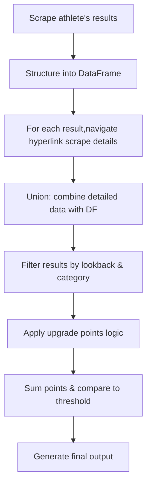

# Extract Results USAC

This project provides a set of helper utilities to pull data from USA Cycling to determine potential upgrade eligibility for cyclists.

## Features

- Fetch race results from USA Cycling
- Analyze results to determine upgrade points
- Generate reports on upgrade eligibility

## Installation

This project uses [`uv`](https://github.com/astral-sh/uv) for dependency management and installation. To install all required dependencies based on `pyproject.toml` and `uv.lock`, run:

```bash
uv venv
uv sync
```

This will create a virtual environment and install all locked dependencies.

## Usage

This script uses a Click-based CLI. To run it, use:

```bash
python main.py --athlete_name "Firstname Lastname" --cat "4" --lookback 12mo
```

You can also use environment variables or a `.env` file to supply these options:

- `ATHLETE_NAME`
- `CATEGORY`
- `LOOKBACK`

## Summary of the Workflow

1. **Scrape** data for racing results for a single athlete.
2. **Structure** the results in a DataFrame (or equivalent data structure).
3. For each result row, **navigate** to the hyperlink and **scrape** more detailed info (placement details, etc.).
4. **Union** (merge) the newly scraped data with the original DataFrame.
5. **Filter** results based on lookback time, category, etc.
6. **Apply** an upgrade-points algorithm to each remaining result:
   - If the race meets certain conditions, compute how many points are awarded.
7. **Sum** those upgrade points and **compare** to the threshold needed to upgrade.
8. **Output** a final summary:
   - From To Category
   - Time period analyzed
   - Number of upgrade points obtained
   - Upgrade point threshold
   - Races that contributed to points
   - Races that did not contribute


### Diagram



## Contact

For any questions or issues, please open an issue on GitHub.
