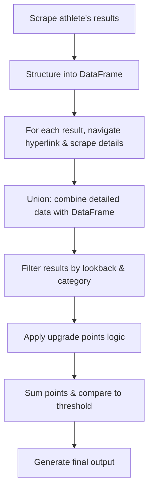

# Extract Results USAC

This project provides a set of helper utilities to pull live data directly from USA Cycling to determine potential upgrade eligibility for cyclists. It no longer relies on local .csv or .json files for data input.

## Features

- Fetch race results from USA Cycling via live endpoints
- Analyze results to determine upgrade points
- Generate detailed reports on upgrade eligibility

## Installation

This project uses [`uv`](https://github.com/astral-sh/uv) for dependency management and installation. To install all required dependencies based on `pyproject.toml` and `uv.lock`, run:

```bash
uv venv
uv sync
```

This will create a virtual environment and install all locked dependencies.

## Usage

This script uses a Click-based CLI. To run it, use:

```bash
python main.py --athlete_name "Firstname Lastname" --cat "4" --lookback 12mo
```

You can also use environment variables or a `.env` file to supply these options:

- `ATHLETE_NAME`
- `CATEGORY`
- `LOOKBACK`

## Summary of the Workflow

1. **Scrape** live data for racing results for a single athlete.
2. **Structure** the results into a DataFrame.
3. For each row, **navigate** to the hyperlink and **scrape** additional details.
4. **Union** the newly scraped data with the original DataFrame.
5. **Filter** results based on lookback period, category, and other criteria.
6. **Apply** an upgrade-points algorithm to each remaining result:
   - Evaluate conditions to compute upgrade points.
7. **Sum** the upgrade points and **compare** with the upgrade threshold.
8. **Output** a final summary:
   - From-to categories
   - Time period analyzed
   - Total upgrade points obtained
   - Upgrade point threshold
   - Races that contributed and did not contribute to the total points

### Diagram



## Contact

For any questions or issues, please open an issue on GitHub.
