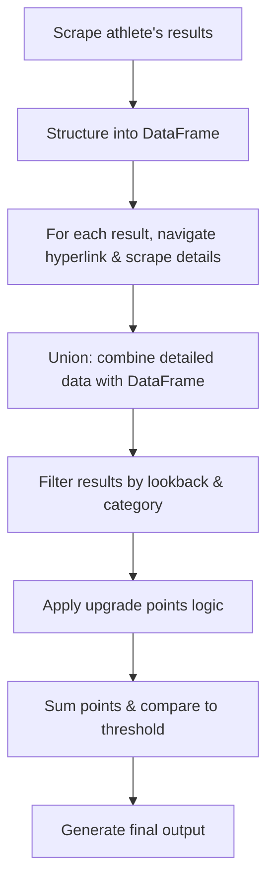

# Extract Results USAC

This project provides a set of helper utilities to pull live data directly from USA Cycling to determine potential upgrade eligibility for cyclists. It can run live or dump and re-used cached results. 

## Features

- Fetch race results from USA Cycling via live endpoints
- Analyze results to determine upgrade points
- Generate detailed reports on upgrade eligibility

## Installation

This project uses [`uv`](https://github.com/astral-sh/uv) for dependency management and installation. To install all required dependencies based on `pyproject.toml` and `uv.lock`, run:

```bash
uv venv
uv sync
```

This will create a virtual environment and install all locked dependencies.

## Usage

This script uses a Click-based CLI. To run it, use:

```bash
python main.py --athlete_name "Firstname Lastname" --cat "4" --lookback 12mo
```

You can also use environment variables or a `.env` file to supply these options:

- `ATHLETE_NAME`
- `CATEGORY`
- `LOOKBACK`
- `DISCIPLINE`

## CLI Parameters Details

Below is a summary of all the available command-line parameters:

- **--athlete_name**  
   The name of the athlete to search for on the USA Cycling results website.  
   *Default:* Sourced from the `ATHLETE_NAME` environment variable if not provided.

- **--category / --cat**  
   The category filter to apply (allowed choices: "1", "2", "3", "4", "5").  
   *Default:* Sourced from the `CATEGORY` environment variable if not provided.

- **--lookback**  
   Specifies a lookback period for filtering results. Accepts flexible formats such as `2y`, `36mo`, etc.  
   *Default:* Sourced from the `LOOKBACK` environment variable if not provided.  
   *Callback:* Processes the input to compute the date from which results should be considered.

- **--discipline**  
   Determines the racing discipline to filter the results. Allowed choices include `cx`, `road`, and `cyclocross`.  
   *Default:* Sourced from the `DISCIPLINE` environment variable if not provided.  
   *Callback:* Converts input (e.g., "cyclocross") appropriately (e.g., to "cx").

- **--dump**  
   A flag to enable dumping of raw results to JSON files.  
   *Usage:* Include `--dump` to trigger this behavior.

- **--use-cached**  
   A flag to instruct the script to use cached results instead of scraping new data.  
   *Usage:* Include `--use-cached` to trigger this behavior.  
   *Note:* Cannot be used simultaneously with `--dump`.

## Summary of the Workflow

1. **Scrape** live data for racing results for a single athlete.
2. **Structure** the results into a DataFrame.
3. For each row, **navigate** to the hyperlink and **scrape** additional details.
4. **Union** the newly scraped data with the original DataFrame.
5. **Filter** results based on lookback period, category, and other criteria.
6. **Apply** an upgrade-points algorithm to each remaining result:
    - Evaluate conditions to compute upgrade points.
7. **Sum** the upgrade points and **compare** with the upgrade threshold.
8. **Output** a final summary:
    - From-to categories
    - Time period analyzed
    - Total upgrade points obtained
    - Upgrade point threshold
    - Races that contributed and did not contribute to the total points

### Diagram



## Contact

For any questions or issues, please open an issue on GitHub.
